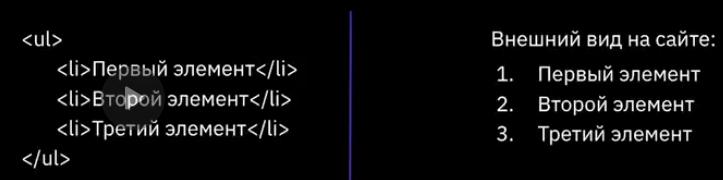
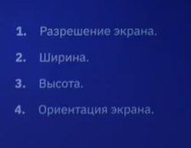
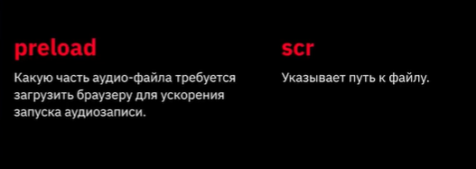

# Что такое HTML
**HTML** - язык разметки.
# Что такое CSS
**CSS** - каскадные таблицы стилей.
# Что такое интернет
Всемирная информационная компьютерная сеть, связывающая между собой как пользователей пк сети, так и пользователей индивидууальных пк для обмена инфы.
# Доменные имена
| домены          |  уровни    | 
|-----------------|------------|
| ru              | домен 1 ур |
| geekb.ru        | домен 2 ур |
| proglive.tiu.ru | домен 3 ур |

# Виды сайтов
1. **Резиновые** - дизайн, в котором ширина столба/ рисунка задана в процентах от текущего расширения экрана.
2. **Фиксированной ширины** - дизайн (таблицный либо блочный), в котором ширина столба/рисунка задана в пикселях, то есть оговорены точно.
3. 
# По содержимому

# Основные протоколы

# Схема HTTP-запроса страницы

# Процесс разработки сайта

# Процесс разработки сайта 

# Парные теги
```<название_тега>текст внутри тела</название_тега>```

# Одиночные теги
```<название_тега>```

# Атрибуты тегов
Определяют какие-либо доп. уточняющие   параметры того или иного тега.

всегда писать на **_англ. яз._** с **_маленькой буквы_** и ставить ```="```.
# Оформление тегов и атрибутов

# Структура HTML-документа

```<meta>``` - поддержка всех языков мира
# Спецсимволы


# Альтернативный метод - Типограф

```<p>размеры комнаты 5&nbsp;м на&nbsp;6&nbsp;м</p>```
# Комментарий 

# Маркированные списки

# Типы ссылок

# фон элемента

# border-рамка

## border-width толщина

# Наследование

## для ссылок

# группировка свойств

# выделение

# цвет

# атрибуты

# CSS


# div и span

# особенности блочных элементов

# строчные элементы

# блочный модуль

# Значение свойства display

### тренажер
https://flexboxfroggy.com/#ru


# Основы flexbox


# Основы grid

1. Линии сетки (grid lines) - это невидимые горизонтальные и вертикальные раздельные линии.
2. Дорожка сетки (grid track) - это пространство между двумя соседними линиями сетки.
3. Ячейка сетки (grid cell) - это пространство, ограниченное 4 линиями сетки.
4. элементы сетки (Grid items) - отдельные элементы, которые назначаются областями сетки.

### тренажер для сетки
https://codepip.com/games/grid-garden/#ru
```необходимо зарегестрироваться перед пользованием на``` https://codepip.com/
# Позиционирование блоков


# Основы создания адаптивного сайта


# Эмуляция мобильных устройств в браузере
# Медиа запросы




# Новые возможности ХТМЛ

# Новые сематические элементы 


# Устройство сайта


# медиа и аудио





